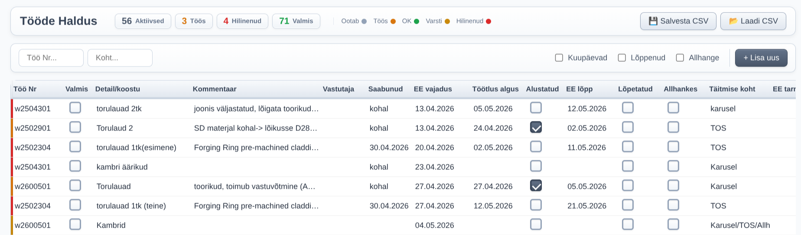

# Tööde Haldus App

A modern, skeuomorphic job management application built with vanilla HTML, CSS, and JavaScript. Replaces Excel spreadsheets with an intuitive web interface.



## Features

### Modern Slate/Gray Design
- **Professional slate-gray color palette** with subtle skeuomorphic elements
- **Custom styled checkboxes** with gradient backgrounds and depth shadows
- **Compact header layout** combining title, status boxes, legend, and actions in a single row
- **Smooth transitions** and hover effects for better UX
- **Custom scrollbar** styling for a polished look

### Core Functionality
- **Load data**: Reads from `jobs_data.json` on page load
- **Add new jobs**: Click "+ Lisa uus" button with modal form
- **Inline editing**: Click any cell to edit directly
- **Mark started**: Check "Alustatud" checkbox → adds date automatically
- **Mark done**: Check "Valmis" checkbox → adds completion date, hides row
- **Show completed**: Toggle checkbox to see/hide completed jobs
- **Filters**:
  - Text filter by "Töö Nr"
  - Text filter by "Täitmise koht" (location)
- **Save**: Click "💾 Salvesta CSV" → downloads updated `jobs_data.csv`
- **Load**: Click "📂 Laadi CSV" → load data from a CSV file

### Status Indicators
- **Aktiivsed** (Active) - Gray
- **Töös** (In Progress) - Amber
- **Hilinenud** (Overdue) - Red
- **Valmis** (Completed) - Green

Row colors indicate status:
- Gray - Waiting
- Amber - In Progress
- Green - OK
- Yellow - Due Soon (≤7 days)
- Red - Overdue

## Project Structure

```
jobs-app/
├── src/
│   ├── index.html      # Main application (HTML + JS)
│   └── styles.css     # All styling (skeuomorphic slate theme)
├── package.json
└── node_modules/
```

## How to Run

### Local
1. Double-click `index.html` or open in Chrome/Edge
2. First open loads `jobs_data.json` automatically (same folder)

### Shared Folder (Collaboration)
1. Put BOTH `index.html` AND `jobs_data.json` on shared network folder
2. Users coordinate: "I'm saving now" → click Save → overwrites shared JSON
3. Last save wins

## Requirements

- Modern browser (Chrome/Edge recommended)
- No build steps needed
- No dependencies required

## All 20 Columns

1. Töö Nr
2. Valmis
3. Valmis kpv
4. Info sisestamise kuupäev
5. Tegevuse sisestaja nimi
6. Detaili/koostu nimetus või joonise Nr
7. Kommentaar(tooriku/detaili seis, muu oluline info)
8. Otsuse/Tegevuse vastutaja
9. Tooriku saabumise kuupäev EE
10. EE vajaduse kuupäev (koostamiseks valmis kujul)
11. Meeldetuletus X päeva ennem
12. Töötluse algus
13. Alustatud
14. Alustamise kpv
15. EE töötluse lõpp
16. Töötlus Lõpetatud
17. Töötlus allhankes
18. Täitmise koht
19. EE kuupäev tarne
20. TE kuupäev tarne

## Recent Updates

### Redesign (April 2026)
- ✅ Replaced all blue accents with **slate-gray** palette
- ✅ Added **skeuomorphic elements**: custom checkboxes, gradient buttons, depth shadows
- ✅ **Compact header**: Combined title + status boxes + legend in single row
- ✅ Moved CSV buttons to **top-right** with icons (💾 📂)
- ✅ Changed legend to **text + small dot** inline format
- ✅ Added subtle **accent color** (#0ea5e9) for interactive elements
- ✅ Custom **scrollbar styling**
- ✅ Added smooth **hover effects** and transitions

## License

MIT
