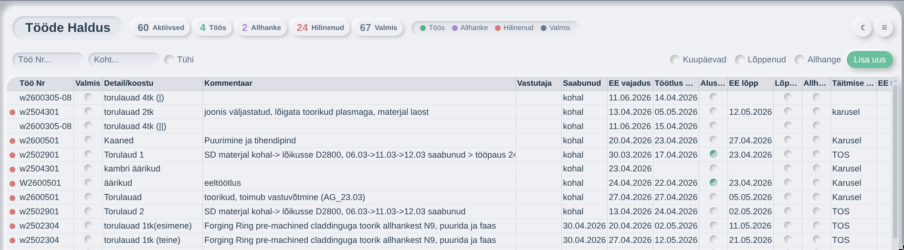

# Tööde Haldus App

A soft neumorphic (soft UI) job management app — replaces Excel spreadsheets with an intuitive web interface. Built with vanilla HTML, CSS, and JavaScript. No dependencies, no build step.

## Features

- **20 columns** for tracking jobs from start to finish
- **Inline editing** — click any cell to edit
- **Auto-date** — check "Alustatud" / "Valmis" sets date automatically
- **Status indicators** — colored dots show Töös / Allhanke / Hilinenud / Valmis
- **Row tinting** — colored status tinting by job state
- **Filters** — by Töö Nr, by Täitmise koht, show completed/allhanke
- **CSV import/export** — save to shared folder, load from CSV
- **Text formatting** — bold (**), important (!!), strikethrough (~~) in cells
- **Undo** (Ctrl+Z), keyboard shortcuts
- **Column resize & sorting** — click header to sort, drag resize handles
- **Soft neumorphic design** — matte off-white palette, mint accent, extruded dual-shadow system, inset pressed states
- **Version info** — Menu → Info shows app name, version, author (auto-built from `server/deno.json`)
