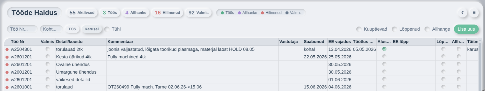

# Tööde Haldus App

A soft neumorphic (soft UI) job management app — replaces Excel spreadsheets with an intuitive web interface. Built with vanilla HTML, CSS, and JavaScript. No dependencies, no build step.



## Current version — 0.3.2

Version 0.3.2 fixes offline recovery, deletion conflicts, and edits affected by delayed polling. It also validates calendar dates, safely displays imported text, and keeps shared-file saving working when browser storage is full. The updated release keeps keyboard focus inside the Add dialog and cell editors within the window as you edit and scroll. All 69 automated tests run before release, including against the compiled Windows executable. See [release notes](CHANGELOG.md).

## Features

- **20 columns** for tracking jobs from start to finish
- **Inline editing** — click any cell to edit
- **Auto-date** — check "Alustatud" / "Valmis" sets date automatically
- **Status indicators** — colored dots show Töös / Allhanke / Hilinenud / Valmis
- **Row tinting** — colored status tinting by job state
- **Filters** — by Töö Nr, by Täitmise koht, show completed/allhanke
- **CSV import/export** — save to shared folder, load from CSV
- **Text formatting** — bold (**), important (!!), strikethrough (~~) in cells
- **Undo** (Ctrl+Z), keyboard shortcuts
- **Column resize & sorting** — click header to sort, drag resize handles. Sorting is remembered in each browser across saves and reopening; Aktiivsed resets filters and sorts by EE vajadus (earliest first, empty dates last).
- **New job reminders** — new jobs default to a 7-day reminder. Existing reminders are unchanged.
- **Soft neumorphic design** — matte off-white palette, mint accent, extruded dual-shadow system, inset pressed states
- **Version info** — Menu → Info shows app name, version, author (auto-built from `server/deno.json`)
- **Safe shared-drive editing** — field-level three-way merge preserves simultaneous changes to different jobs or fields
- **Conflict protection** — same-field conflicts retain both values; comments can be combined and edited before saving
- **Connection indicator** — quiet green status dot with persistent saving, disk/server error, and conflict details
- **Automatic backups** — creates a validated shared-data snapshot every 48 hours and retains the newest 36 in `backups/`

## Tests

Run `deno task test` from `jobs-app/server` with Deno 2 and Chromium installed.
Use `CHROME_BIN` to select another Chrome executable. Tests use temporary data
and browser profiles, including two server processes sharing a test file.
See [test instructions and coverage](jobs-app/server/tests/README.md).

Tests run on pushes and pull requests and must pass before the release build.

## Shared-drive collaboration

Each user runs the same current-version executable. Point every shortcut to the same shared JSON file:

```text
"K:\your-folder\jobs-app.exe" --data "K:\your-folder\jobs_data.json"
```

The app assigns permanent hidden IDs to jobs and merges changes one field at a time under an exclusive shared-drive lock. Changes to different rows or fields are preserved automatically and normally appear for other users within two seconds.

All users must upgrade together when the synchronization protocol changes. An older executable can still perform an unsafe whole-file save.

## Shared files and backups

The shared folder normally contains:

```text
jobs-app.exe
jobs_data.json
jobs_data.json.version
backups/
```

The revision file supports reliable polling on network drives. A temporary `jobs_data.json.lock` directory exists only during a protected operation.

The first running app checks for backups shortly after startup and at most hourly after successful saves. When the newest valid backup is at least 48 hours old, it creates a validated snapshot in `backups/`. The newest 36 valid backups are retained.
